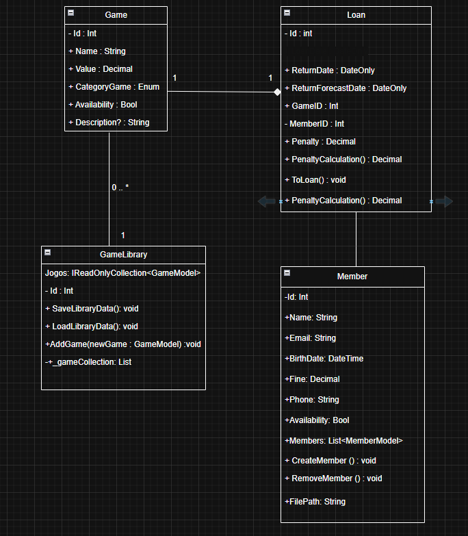

# Trabalho AV1 - POO:
### Alunos:

Carolina Diaz - 06010688

Heloiza Custódio - 06009234

Larissa Ferreira - 06011175

Yuri Domingues - 06010142

## Diagrama de Classes:

## Requisito 2 – Encapsulamento e Validações

Este documento lista as quatro classes implementadas no projeto, destacando:

* **Construtores** (`[AV1-2]`)
* **Serialização e persistência** (`[AV1-3]`)
* **Validações e tratamento de erros** (`[AV1-5]`)

---

### Classe `GameLibrary`

Arquivo: `Models/GameLibrary.cs`

* **Construtor**

  * Linha ~15 → `public GameLibrary()` `[AV1-2]`
  * Cria o diretório `data/` com tratamento de erro (`IOException`).

* **Validações e Tratamento de Erros** `[AV1-5]`

  * `AddGame`

    * Linha ~23: impede adicionar jogo `null`.
    * Linha ~26: impede jogos duplicados pelo `Id`.
    * Linha ~29: valida nome do jogo.
    * Linha ~32: valida valor não negativo.
  * `SaveLibraryData`

    * Linha ~65: tratamento de exceções ao salvar (`IOException`).
  * `LoadLibraryData`

    * Linha ~87: tratamento de exceções ao carregar (`IOException`).

* **Serialização** `[AV1-3]`

  * `SaveLibraryData` → Serializa biblioteca em JSON.
  * `LoadLibraryData` → Desserializa biblioteca de `biblioteca.json`.

---

### Classe `GameModel`

Arquivo: `Models/GameModel.cs`

* **Construtor**

  * Linha ~12 → `public GameModel(int id, string name, decimal value, CategoryGame categoryGame, string description)` `[AV1-2]`

* **Validações** `[AV1-5]`

  * `id > 0`
  * `name` não vazio
  * `value >= 0`

---

### Classe `LoanModel`

Arquivo: `Models/LoanModel.cs`

* **Construtor**

  * Linha ~13 → `public LoanModel(int id, int gameId, int memberId, DateTime loanDate, DateTime expectedReturnDate)` `[AV1-2]`

* **Validações** `[AV1-5]`

  * `gameId > 0`
  * `memberId > 0`
  * `expectedReturnDate > loanDate`

* **Métodos com validações adicionais**

  * `CalculateFine` → calcula multa apenas se devolução atrasada.
  * `SetReturnDate` → define data de devolução explicitamente.

---

### Classe `MemberModel`

Arquivo: `Models/MemberModel.cs`

* **Construtor**

  * Linha ~17 → `public MemberModel(string name, string email, DateTime birthDate, string phone)` `[AV1-2]`

* **Validações** `[AV1-5]`

  * `name` não pode ser vazio.
  * `email` deve ser válido (contém `@`).
  * `birthDate` precisa ser maior que 12 anos atrás.

* **Serialização** `[AV1-3]`

  * `SaveMembers` → salva membros em `members.json`.
  * `LoadMembers` → carrega membros do arquivo JSON.

---